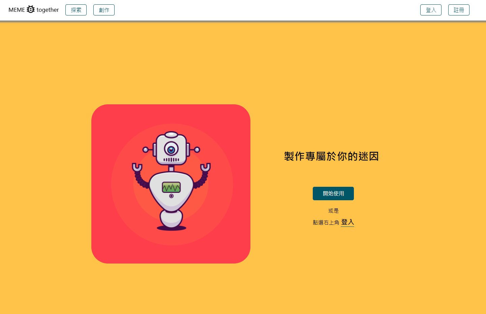
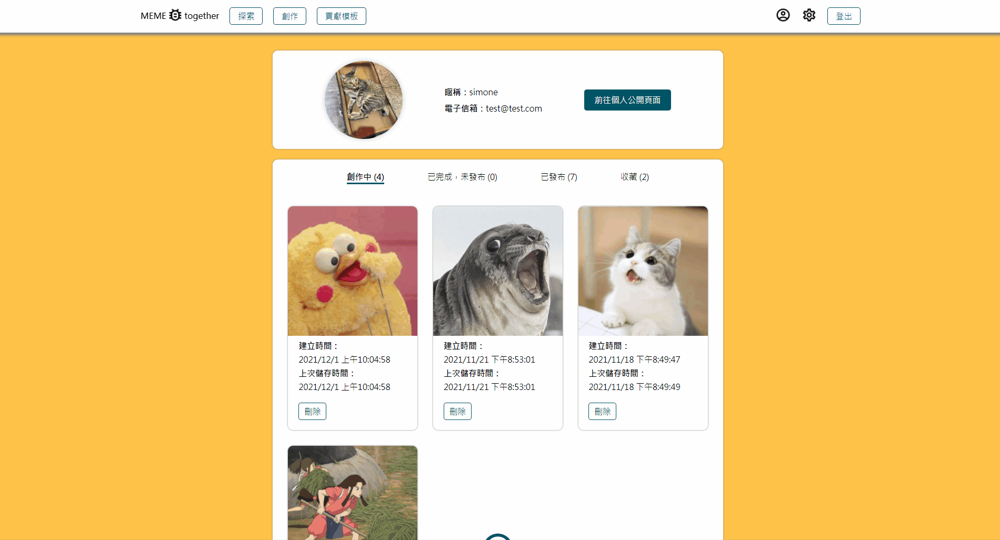
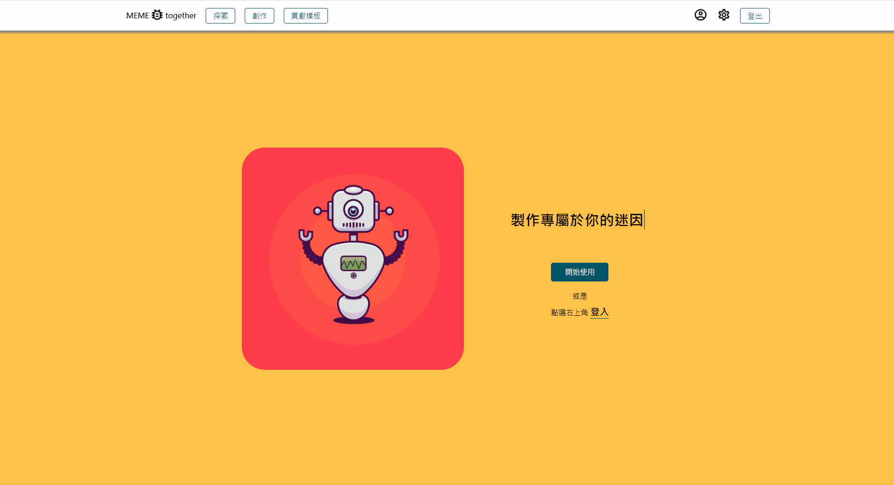
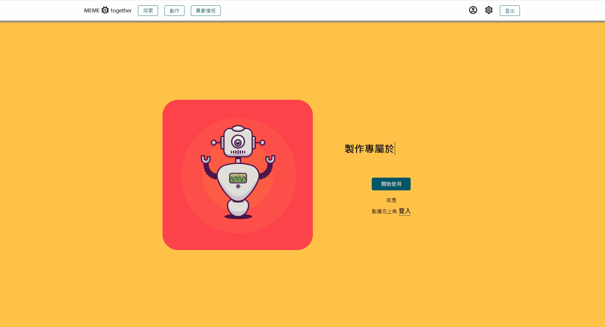

# 🐳 Meme Together
A website for users to produce meme and share to their friends. Let's have fun!
- Use `fabric.js` to create a meme generator.
- Use `React` and `Styled` Components for page layout.
- Use `React Router` for navigation.
- Use `Redux` for state management.
- Integrate member system and database with `Firebase` service, including `Firestore`, `Storage`, and `Authentication`.

## 🦀 Demo
- Website Link: https://meme-together.web.app/
- Test Account:
    - Email: 456@456.com
    - Password: 123456

## 🦀 Techniques
### Fundamental
- HTML
- CSS
- JavaScript (ES6)

### Framework
- React (Hooks)
- React Router
- Redux

### Firebase
- Authentication
- Firestore
- Storage
- Hosting

### Packages
- Styled Component
- fabric.js
- compressjs
- Sweetalert2
- Animated.css
- react-icons
- react-loading

## 🦀 Flow Chart

## 🦀 Features
- Edit your meme and save the editing status

- Release your wonderful meme

- Explore other person's meme and follow the person you like

- Search other meme, add it to your favorite list, and leave a message

- Manage your profile info, change your password, or leave **Meme Together**

## 🦀 Future Features
- Build GIF meme generator
- Build notification function for users
- Build server with back-end tools such as AWS, Docker, EC2, Node.js, SQL to integrate more meme data into project

## 🦀 Contact
**Author** - Simone Cheng  
**Email** - bleach1827@gmail.com